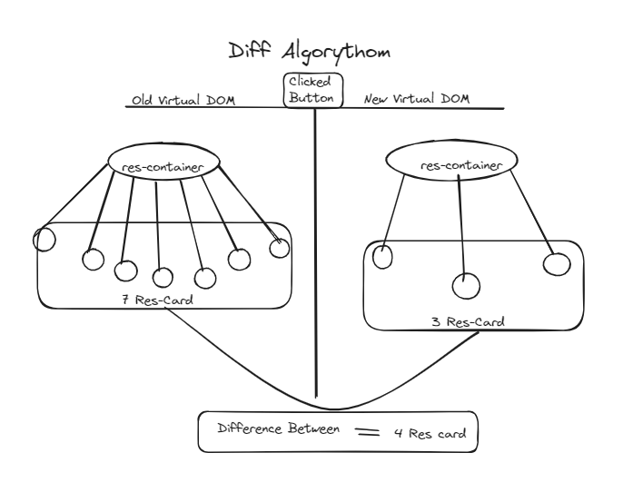

# Episode - 05 Namaste React

## Why React is fast?

- React is fast because it has virtual dom. It has diff algo it can do efficient dom manipulation.

## Two type of export and import

- 1: **Named Export**- If we have export multiple things in one file then we use named export.

```
export const ComponentName;
```

- 1: **Named Import**- Use curly braces and write same component name inside curly braces.

```
import {SameComponentName} from "file path";
```

- 2: **Default Export** - This export can only one in file. You not write default export many time in one file.

```
export default ComponentName;
```

- 2: **Default Import** - Don't use any curly braces when you importing default and not mandatory to write same component name which exported default.

```
import NotMandatorySameComponentName from "file path";
```

## We will make our app dynamic

- The React main work is the **ui layer and the data layer work each other properly**, if my **data changes my ui changes**. this is the thing all the framework trying to solve , **updating the dom efficiently**.

- here come for updating the dom `useState`.
- we use react hook to updating the dom.

### React Hooks

- A hook is normal Javascript utility function which is given us by react. There are multiple function those are known as hooks.

> Two hooks are most important.

- **useState()** - superpowerful state variable in react. useState() return array.

```
const arr = useState();
const [variableName, setvariableName] = arr;
const variableName = arr[0];
const setvariableName = arr[1];
```

- first named import from react librarey.

```
import {useState} from "react";
```

- then initate the useState hook.

```
const [variableName , setvariableName]= useState();
```

- **Note** When ever state variable changes react will re-render our component.

- local state variable scope is inside that component.
- useEffect()

## Why react is fast if in interviews anybody ask?

- Because it can do faster dom manipulation, it ca do efficient dom manipulation, there is something known as virtual dom, there is something known as dif algorythom, there is something known as reconciliation.

## Reconciliation Algorythom (React Fiber)


- On the ui suppose we have resturant-container dom(tree like structure) and this res-container inside suppose we have 7 res-card, now my changes filtering these seven card to only 3 card. What react do why react is fast now I will tell you.

- First of all react create **Virtual DOM** for 7 res-card.

- **Virtual DOM** Virtual DOM is not an actual DOM(What is actual dom? - actual dom is the tag means tag inside tag.). **Virtual dom is a representation of an actual dom.**

> What does mean by representation of an actual dom?

- Virtual dom is that object ({}). Virtual DOM is basically those react elements-

```
(
    <div className="body">
      <div className="search">Search</div>

      <button
        className="res-btn"
        onClick={() => {
          const filterList = listOfRestaurent.filter((res) => {
            return res.data.avgRating > 4.2;
          });

          setListOfRestaurent(filterList);
          console.log(listOfRestaurent);
        }}
      >
        restaurent button
      </button>

      <div className="res-container">
        {listOfRestaurent.map((restaurant) => (
          <ResturantCard key={restaurant.data.id} resData={restaurant} />
        ))}
      </div>
    </div>
  );
```

This is vartual Dom

```
console.log(<Body/>)

//! Result /////////////////////////////////

Object
$$typeof
:
Symbol(react.element)
key
:
null
props
:
{}
ref
:
null
type
:
()=> {…}
_owner
:
FiberNode {tag: 0, key: null, stateNode: null, elementType: ƒ, type: ƒ, …}
_store
:
{validated: false}
_self
:
Window {window: Window, self: Window, document: document, name: '', location: Location, …}
_source
:
{fileName: 'src/App.js', lineNumber: 5, columnNumber: 15}
[[Prototype]]
:
Object
```

- this Console log printend object, when we write in previous video React.createElement("h1", {}, ""), this was object so in bigger picture this <Body/> component is also Object.

> How react read this jsx?

- It creates an object of it **so this object is basically a React Virtual DOM. so this react vartual dom kind is nothing but a normal Javascript object.**

> What is Diff Algorythom?
> 

- **Diff Algorythom is find the difference between two virtual dom/ object. Diff Algorythom is find out the difference between upadated virtual dom/object and previous virtual dom/object then it will update the actual dom, that's how react become faster.** And suppose I clicked the button(whose filtering res-card) as soon as a new object is form and react find out the difference between two objects(old and new) and then it actually update the dom. React does not touch the html tag to update the dom it touch only objects.

- When there change the any state variable react will find out the difference between virtual dom and will re-render the component, update the dom.

- Old virtual dom and new virtual dom have difference between of **4 Nodes**. **It will then calculate the difference and actually update the dom on every render cycle.**

> REVISION

- This whole algorythom is known as React Fiber which is come in 2016 . In react16 a new algorythom to update the dom came out that known is Reconciliation(When ever something change on the ui this is known Reconciliation.)

- D
