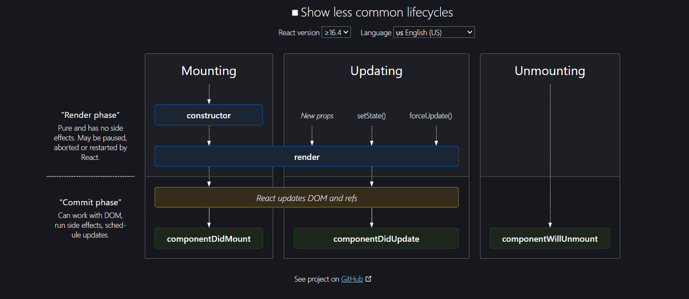
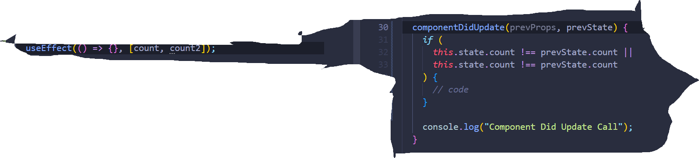

# Episode-08 | Let's Get Classy



> Reaserch about super() method and why we not write async in useEffect?

> ## We Learned In this episode.

- What is class base component
- How we declare this class base component
- why we use extends keyword and React.Component
- Then we know about render() method
- Then we know about constructor function
- How can we catch props using constructor function
- then we know about super() method which hold props
- then we learn about state variable
- and where we should write state variable
- then learn how to update this state variable using
  this.setState() method
- learn about relationship between parent function
  component and child class component
- learn about parent and child class component
  relationship
- learned about child class life cycle method
- learned about parent and child life cycle method, how
  it works?
- learned about life cycle method diagram
- learned about Render phase and Commit phase
- learned about mounting
- learned about which first call, first constructor then
  render then dom update then componentDidMount call
- learned where we should make api call
- learned about how updating phase work
- learned when componentDidUpdate call
- learned about Unmounting phase
- learned componentWillUnmount
- learned differnce between useEffect and
  componentDidMount, componentDidUpdate and
  componentWillUnmount
- learned how can we do unmounting in useEffect

## In This episode we learn about class base component.

- We will Make class base component to about component, We fetch tha data from github and show in our about component.

## Class base component

- as a like function component is javascript function and return jsx code , Here same the class base component is javascript class but here we only write after declare class name `extends React.Component` to tell the react this is class base component.

**Syntax**

- use Keyword `class`
- name of the class `UserClass`
- and the write `extends React.Component`

```
class UserClass extends React.Component {

}
```

- I will write inside class render() method whose return us some peace of jsx code which will be displayed on the ui.

```
class UserClass extends React.Component {
  render() {
    return
  }
}
```

## Difference between class base component and function base component

- Functional component it's a function and that return some peace of jsx.

- Class base component is class which has render method which return some peace of jsx.

## What is React.Component ?

- This **React.Component** is basically a class which is given to us by react and UserClass is inheriting some property of it.

- and this React.Component is given us by react. So we can import from react librarey.

```
import React from "react";
```

- We can also export in same way.

```
export default UserClass;
```

```
import React from "react";

class UserClass extends React.Component {
  render() {
    return (
      <>
        <h1>Hello I am class Component</h1>
      </>
    );
  }
}

export default UserClass;
```

## How Can recive props into class component ?

- This class wil have constructor and this **constructor will receive the props**. And we will have to use this keyword super(props). and if we console of props so i will receive this props inside user class inside constructor.
- You can not avoid super() because it's give us error.

```
import React from "react";

class UserClass extends React.Component {

constructor(props){
  super(props);
  console.log(props);
}

  render() {
    return (
      <>
        <h1>Hello I am class Component</h1>
      </>
    );
  }
}

export default UserClass;
```

## How I use this propes in our render() function in jsx code?

- you wil always have use `this` keyword inside your class. So that this props can be accessed anywhere inside my class.

```
this.props.name
```

```
import React from "react";

class UserClass extends React.Component {

constructor(props){
  super(props);
  console.log(props);
}

  render() {
    return (
      <>
        <h1>Hello I am class Component</h1>
        <p>{this.props.name}<p/>
      </p>
    );
  }
}

export default UserClass;
```

## Why do we have always write super(props)?

## ## How can we create state variable inside class component?

- Functional component and hooks this is very new concept in react earlier there use to be no hooks and functional component so there was an old way of creating state over here.

**Note:-** When I say we rendering a functional component what dose it means basically? - So basically on your web page if tehre is functional component it loads so that means you are mounting that functional component or calling that functional component.

- When I am say Loading a class base component on web page that means I am creating an instance of that class.

- When ever you create a instance of class this constructor is called and **this is the best place to recieve the props and this is best place to create state variable.**

- **For creating state you use `this.state` reserve keyword and this state is basically of a big whole object which containes state variable**.

```
import React from "react";

class UserClass extends React.Component {

constructor(props){
  super(props);

//! creating state variable
  this.state ={
    count:0
  }

}

  render() {
    return (
      <>
        <h1>Hello I am class Component</h1>
        <p>Count: {this.state.count}<p/>
        <P> {this.props.name}<p/>
      </>
    );
  }
}

export default UserClass;
```

> How can be use our state variable?

```
<p>Count: {this.state.count}<p/>
```

## How we write multiple state variable in class component?

- We write in same way in first time.

```
constructor(props){
  super(props);

//! creating state variable
  this.state ={
    count:0,
    count1: 1,
    count: 2,
  }

}

```

## How Can we update the state variable in class component?

- We don't update the state variable directely.
- Never update state variable directely.

```
<button onClick(()=>{
  this.state.count = this.state.count + 1;
})><button/>
```

- **What is the way to update?**
- To update state variable we use **this.setState()** and use this anywhere inside the class.

- **this.setState()** inside we will pass object this object will contain the updated value of our state variable.

```
<button onClick(()=>{
  this.setState({
   count: this.state.count +1;
  });
})><button/>
```

- And when ever this state variable update the count, react will re-render the class component.

- What ever value passed inside setState only those value change, react not the change whole state variable value.

```
class UserClass extends React.Component {
constructor(props){
  super(props);

//! creating state variable
  this.state ={
    count:0,
    count1: 1,
    count: 2,
  }

}

render(){
  const {count, count1, count2} = this.state;
  return (
    <>
    <p>Count: {count}</p>
    <p>Count: {count1}</p>
    <p>Count: {count2}</p>

    <button onClick={()=>{
      //! Update the count state variable using setState()
      this.setState({
        count: this.state.count + 1,
        count2: this.state.count2 + 2,
      })
    }}>Increase Count</button>
    </>
  )
}
}

```

- When this onClick button clicked react will retriggred
  that Reconciliation process It will find diff that object it will update the state variable it will re-render the component that's how react will work.So basically how update the state variable.

# What are React component life cycle method in the class base component? How is the class component mounted

# on the web page? How it put on the web page?

- When we say loading the component that means mounting the component on the web page.

- See About us component is parent component and UserClass is inside this about component. When ever this about page component render on the web page or maybe mounted on the web page so it's basically start rendering jsx and when ever it rendering sees oh here is the UserClass component so it start to load user class now a new instance of this class created.

- And what happened this class is called or maybe intenciated so what happen is the first Constructor is called. Once is Constructor is called then render is called. How is the class intenciated.

```
import React from "react";

class UserClass extends React.Component {
  constructor(props) {
    super(props);
    console.log(props);

    //! creating state variable
    this.state = {
      count: 0,
      count1: 1,
      count2: 2,
    };

    console.log("First Constructor Called");
  }

  render() {
    console.log("Second Render is Called");
    const { name, email } = this.props;
    const { count, count1, count2 } = this.state;
    return (
      <>
        <h3>Count: {count}</h3>
        <h3>Count: {count1}</h3>
        <h3>Count: {count2}</h3>
        <button
          onClick={() => {
            this.setState({
              count: this.state.count + 1,
              count2: this.state.count + 4,
            });
          }}
        >
          Increase Value
        </button>
        <h2>Name: {name} Class Component</h2>
        <p>Contact: {email}</p>
      </>
    );
  }
}

export default UserClass;

```

## This become little complicated when make the parent About also class base component.

- So first of all about component is intenciated a new intance of class is created so the parent construcor of this class called then the render of this parent is called then it gose to children it again the triggered the life cycle and now the construcor of this child is called and then the render of this child is called

- **Parent Construcot => Parent Render then Child Construcot => Child Render is called**.
- This is how things work over here. This is the how life cycle of class component work.

## This is very easy but why you say this is very important question?

- Just we like have constructor and render method class base component also have one more method that is known as **componentDidMount**.

- **componentDidMount** - This is another method which react class base component gives to us.So basically what happen is when the component is loaded first of this construcor is called then the render method is called and once this class base component mounted on the dom then this **componentDidMount** is called.

- **Construcot => Render => then componentDidMount will called** This is the mounting cycle , this is the life cycle of react class component. that is why the name there **componentDidMount**. this will be called when the component is already mounted on the web page.

- Suppose if we had this **componentDidMount** inside my parent also.

## Now This make importnat interview question in what order will these function be called?

**Parent Component**

```
import { Component } from "react";
// import User from "./User";
import UserClass from "./UserClass";

//! Class base Component

class About extends Component {
  constructor(props) {
    super(props);

    this.state = {
      count: 0,
    };
    console.log("About Class Component Parent Constructor");
  }

  componentDidMount() {
    console.log("Parent Component Did Mount");
  }

  render() {
    // const {}= this.state;
    console.log("About Class Component Parent Render");
    return (
      <>
        <h1>About Class Component</h1>

        <UserClass name={"Alok Singh"} email={"alok4298@gmail.com"} />
      </>
    );
  }
}


export default About;

```

- **Child Component**

```
import React from "react";

class UserClass extends React.Component {
  constructor(props) {
    super(props);
    console.log(props);

    //! creating state variable
    this.state = {
      count: 0,
      count1: 1,
      count2: 2,
    };

    console.log("First Child Constructor Called");
  }

  componentDidMount() {
    console.log("Child Component Did Mount");
  }

  render() {
    console.log("Second Child Render is Called");
    const { name, email } = this.props;
    const { count, count1, count2 } = this.state;
    return (
      <>
        <h3>Count: {count}</h3>
        <h3>Count: {count1}</h3>
        <h3>Count: {count2}</h3>
        <button
          onClick={() => {
            this.setState({
              count: this.state.count + 1,
              count2: this.state.count + 4,
            });
          }}
        >
          Increase Value
        </button>
        <h2>Name: {name} Class Component</h2>
        <p>Contact: {email}</p>
      </>
    );
  }
}

export default UserClass;

```

> Now I will tell you how parent and child relationship work over here.

- Now what will happen it When this parent about component will loaded so what will happen is this constructor will call then render will be call and when the component is rendering so it will render this jsx and go to UserClass base children component , so it has not yet finish mounting it will go to child class base component and it will trigger child class base component life cycle method. **Now then UserClass constructor will be called then this children render will be called then the children component did mount will be called and once children has mounted properly on web page then the parent component did mount will be called**.So this is the life cycle of parent child relationship.

> **Parent Constructor => Parent Render => Child Constructor => Child Render => Child componentDidMount => parent componentDid Mount**

## So what is the use case of componentDidMount?

- **componentDidMount is used to make API calls**. very important use case.

- react wants to quickley render it then make API call then render the data. This is why we use useEffect() and simillarly in the class base component I want to quickly
  render my component then make API call fill the data.

- I will first render my component , constructor will be called, render will be called now my component has been rendered now I will make an API call over here and then fill the data of the API call inside my component and then it will re-render the component. So this is how we do inside class base component.

## If we had multiple children component let's see how that life cycle works now?

- Now we copy paste UserClass so we have two instance of same UserClass. So now how the life cycle will these works?

- We assuming how life cycle work if we have multiple child class in parent class.

```
- Parent Constructor Called
- Parent Render Called

   - Atul Constructor Called
   - Atul Render Called
   - Atul componentDidMount Called

   - Alok Constructor Called
   - Alok Render Called
   - Alok componentDidMount Called

- Parent componentDidMount Called
```

- This assumption is wrong my dear friend. This is not how life cycle methods called and there are multiple children.

- **Why** react is confusing us?
- React is not confusing react is just optimising
- So let's see what happen behind the scene if above assumption is wrong.

> So write life cycle is below--

```
- Parent Constructor Called
- Parent Render Called

   - First Child Constructor Called
   - First Child Render Called


   - Second Child Constructor Called
   - Second Child Render Called

   - First Child componentDidMount Called
   - Second Child componentDidMount Called

- Parent componentDidMount Called
```

> **But why did the life cycle method work like this?**

- Now for this dive deep into one more concept , There is something known as react life cycle method diagram and this diagram make you clear everything.

- React has two phases first is **Render Phase** and second is **Commit Phase** this is the life cycle works.

> What happen render phase and what happen commit phase?

- When the component is mounting first of our constructor is called then the render is called, this construcor and render is the **render phase**, then the react is actually update the dom and then componentDidMount is called that is why the best place to make API call.


- What will happen the first child constructor will call, first child render wil call and then render phase finish now it will start the render phase second child, it will finish the second child constructor and call second child render now the commit phase for first child then commit phase for second child will be badged together, so these render phases badged, the commit phases badged that is why the output will be in this order.

```
- Parent Constructor Called
- Parent Render Called

   ( **This is RENDER PHASE both the children**

   - First Child Constructor Called
   - First Child Render Called


   - Second Child Constructor Called
   - Second Child Render Called
   )

   - < DOM UPDATED - IN SINGLE BATCH>

  ( **This is COMMIT PHASE both the children**

   - First Child componentDidMount Called
   - Second Child componentDidMount Called
  )
- Parent componentDidMount Called
```

- **Once the commit phase start react is trying to update the dom and dom manipulation is the most expensive things when we updating the component**. When we loading our component dom manipulation is very-very expensive. It takes a lot of time , so react wants to batch the render, when the react is rendering basically react is triggering the Reconciliation and in this
  Reconciliation that object and those another object it finds out the diff between this virtual dom and virtual dom is created, so everythings render phases happening inside virtual dom. Why virtual dom is fast because virtual dom is just javascript, just deals with object.

- In this render phase react is just finding diff of that object and then what happen is when it try update the dom it says that ok let me find out all the childrens batch the render phase because **render phase is very fast. Comit phase take time**,So the commit phase takes time that is why the batched the render phase all the child component is renderd then the commit happen.

- Updating the dom is expensive task so react tries to batch up the task, react tries to batch render,react tries to batch of updating the dom, react tries to batch things of all children, that is why react is fast.

## How do we call API inside componentDidMount?

```
async componentDidMount(){
  const data = await fetch("https://api.github.com/atulsingh");

  const json = data.json();
}
```

- First of all our constructor was called with some dummy data then jsx code will render some dummy data and react updated the dom some dummy data and now our componentDidMount was called and this componentDidMount was called with an api was called made when the api was called made componentDidMount was called setState when the setState will called the updating cycle happen and now setState update the state variable when the state variable is updated and react triggred the render() function once again and now the state variable change with updated value and now in the update cycle, react will now update the dom new value. and then the update cycle says now it will call **componentDidUpdate**.

- Yes we have **componentDidUpdate** also and this componentDidUpdate call later on at the end. And that's how are update cycle is work.

```
/*
----------First Mounting Cycle Happen-------------
1: Constructor call
2: Render call(with some dummy data)
3: this Dummy data showed on DOM
4: Component Did Mount called
5: API Calls
6: this.setState - will update the state vairable

----------Second Update Cycle Happen-------------
7: render(Api data) method call , this.setState  call the render method
8: DOM will updated with new data
9: componentDidUpdate
*/
```

> First of mounting cycle happen and then update cycle happen. What about Unmounting cycle?

> 3:- **componentWillUnmount()**

- Mounting means shoeing on ui and Unmounting means removing from ui.
- When we leave the about class page and go to another page **componentWillUnmount()** call. This is the how life cycle is work.

### So here is the come Functional component because in class base component we did so much componentDidMount()

### componentDidUpdate() and componentWillUnmount(), this is so confusing that's why Functional component is come into the picture.

## We want to go more deep inside class base component, let's do.

**Note:-** Never ever compare react class life cycle method to functional component.

- more people compare to useEffect() from componentDidMount(){} , never ever compare both because useEffect is not work like that componentDidMount , useEffect is new way.

- When our useEffect will call?
- After every render my useEffect will call if we not write dependency array. Now things in class base component, After first render componentDidMount(){} will called and after every subsequent render it's updated, there is difference mount, update and unmount.

```
useEffect(()=>{
 //useEffect will call on every render
});
```

- If we write dependency array in useEffect and it will call only once in first render.

```
useEffect(()=>{
//useEffect will call only once in first  render
},[]);
```

- What will happen if we write count inside dependency array, every time my count changes that will call.

```
useEffect(()=>{
//useEffect will call on every count changes
},[count]);
```

- How will something I do in my class base component, now in class base component , we know that one life cycle method is called after every render, what that life cycle method, **that life cycle method is componentDidUpdate**, we know that componentDidUpdate will call after every update.

- This pic is comparison to useEffect Update and componentDidUpdate. You can clearly see when we want updating in componentDidUpdate it very painful. So that is the reason we use useEffect and we use functional component.
  

- Did you understand why write this array in useEffect?
- Because you know earlier people write condition in if else inside componentDidUpdate , react developer said that ok let's make as an array we write in array multiple state variable.

```
useEffect(()=>{
},[count, count2]);
```

```
 componentDidUpdate(prevProps, prevState) {
    if (
      this.state.count !== prevState.count ||
      this.state.count !== prevState.count
    ) {
      // code
    }

    console.log("Component Did Update Call");
  }
```

- If we write another useEffect() whose dependency array take seprate count2 state variable, so how we will write in componetDidUpdate, in componetDidUpdate we will write two if else condition.And these if else condition not small these are 30, 40 line.

```
useEffect(()=>{
},[count]);

useEffect(()=>{
},[count2]);
```

```
 componentDidUpdate(prevProps, prevState) {
    if(this.state.count !== prevState.count){
      // code
    }

    if(this.state.count !== prevState.count2){
      // code
    }

    console.log("Component Did Update Call");
  }
```

## More Dive Deep

### When will be use Component Will Unmount?

- Component Will Unmount call when we are leaving the page,In react how many pages we have, It's a **Single Page Application** we are the just changing in component. When we go to home component to about component what is happening, it we are changing the page eventually the concept of the page we are changing but it is a single page itself **so there are lot of things to clear when we leaving the page**.
- You know single page application have some cons in it.
- Suppose we have setInterval in componentDidMount , it started printing namaste react op ahter 1 second.

```
 componentDidMount() {
   setInterval(()=>{
    console.log("Namaste React OP")
   },1000)
  }
```

- Now the issue in single page application is when to move in new page right in home page , it setInterval still calling, when we go another page the setInterval still calling without permission.

- Because you are changing the pages it is not reloading your page it is just changing the component, it is just rendering, react is reconcilling, It is the power of Single Page Application(SPA) but it is bad things about SPA. This set time out hangging in the browser, This is the maturity of the senior developer, If we don't write console log inside setInterval, you will never know there are ten thousand set interval hagging on.
- Senior developer will know ok every time I will load my component every time my component did mount will be called there is set interval that will triggred, the new set interval creating every time and it will stay, so this an important things you should know as senior developer.

## How we will clear this set interval?

- **We clear set interval in my componentWillUnmount**
- but how will I refrence that set interval in our componentWillUnmount?
- We use **this.timer** keyword before set interval.

```
componentDidMount() {
this.timer = setInterval(()=>{
console.log("Namaste React OP")
},1000)
}

componentWillUnmount(){
  clearInterval(this.timer);
}

```

- And **this.timer** keyword shared with all the method with this class component.

- Now when we refreshing my page it's start set interval first time and when we go another page componentWillUnmount triggred and stop this setInterval. This is the proper use case of **componentWillUnmount**.
- When we again about page it's set interval again start and move another page this is stop , so we expecting of the exact behaviour.
- When you are creating mess code, you clean your mess code also.

## What if we write set Interval inside our useEffect()? What will happen?

```
useEffect(()=>{
  setInterval(()=>{
    console.log("Namaste React OP")
  },1000)
},[])
```

- This setInterval is also not stop inside useEffect, so there is something known as you can return a function from useEffect, this return function is basically called you are unmounting from this component and then this set interval is stop when you move on another page.

```
useEffect(()=>{
  setInterval(()=>{
    console.log("Namaste React OP")
  },1000)

  return ()=>{

  }
},[])
```

- This return function is called when you unmounting it.

```

const User = () => {

  //! unmounting the page to stoped the set interval
  useEffect(() => {

       console.log("use effect called before return
         function")
 return () => {
       console.log("useEffect called inside return
        function")
    };
  }, []);

console.log("render in first time")

};
```

- **Means in functional component when you Unmount(means you go one page to another page so first you unmount the previous page) any things you write return function inside usEffect()**.
- so how can you clear setInterval , using useEffect return function because this return function is unmounting every mess code which ever you want.

```
useEffect(()=>{
 const timer = setInterval(()=>{
    console.log("Set Interval from useEffect");
  },1000)

//! Unmounting the messed code
  return ()=>{
    clearInterval(timer);
  }
},[])
```

- If we go to about page setInterval is calling again and again and when move another contact or home page this setInterval is stopped because we using unmounting in useEffect. we use return function inside useEffect callback function which will do unmounting for us.

# We understand class base component and life cycle method of class base component?

**Note:-** learn useEffect, componentDidMount, componentDidUpdate and componentWillUnmount

## When react is building they build all the life cycles things they realise if we continue doing this developer will stop writing react, that is why react came of the better way of doing it Functional component, Hooks and science then react picked up again.
