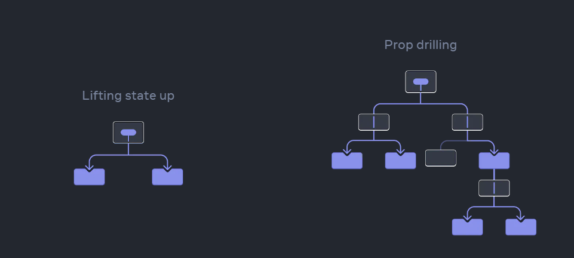

# Episode-11 | Data is the New Oil

> **Data management is essential in React development. In this episode, we explore how to handle and manipulate data using state, props, and other powerful React techniques.**

## Higher Order Component in React?

- **Higher order component is a function that takes a existing component and it's just enhancing it and modifying it and then return back component, that is known as higher order function.** And at the end of the day this is normal JS Function.

- We created higher order component(withPrometedLabel), this taking RestaurentCard as an input now it withPrometedLabel will return new component but this time it will have promoted label on top of it.

- When we write higher order component these are pure function, what is mean pure function , So we will not modified the code of ReastaurantCard not change the behaviour this card in anyway, we are not modifying the ReastaurantCard component features it is exactley the same, We are adding just something on top of it.

- All the react applcation have two layers on layer is ui and another layer is Data layer and this ui layer is powered by data layer.

- Data layer is very important if you know how to manage your data in react application your application will be super fast, very performent, the major part to handle this data layer.

- So basically when we say ui layer it is mostly consisting of jsx the code you write in jsx that is the ui layer and data layer is your state, your props, your local variables, that curly braces inside your jsx that js code we write is all modifing the data layer, this is what ui layer and data layer.

### How do we manage data properly in our app this what we learning in this whole episode? If you know how to manage data properly you will we making super amzing react app.

## Controled and Uncontroled component?

- If the RestaurantCategorey was controlling itself it's a uncontrolled component, If We take away this power that is an uncontrolled component because it is relying upon it's parent to tell it's what it do now this is controlled component, now we controlling it from RestaurentMenu.

> **Uncontrolled Component** - Because it's controlling by itself using showItems.

```
const RestaurantCategorey = (props) => {
  const [showItems, setShowItems] = useState(false);

  function handleClick() {
    setShowItems(!showItems);
  }

  return (
    <>

      <div >

        {/* Accordion Body */}
        {showItems && <AccordionItemsList items={data?.itemCards} />}
      </div>
    </>
  );
};
```

- There is no specific definition of controlled and uncontrolled component it is just philosiphy, some people call it as that RestaurantCategorey is a controlled component that means, We can control it via props, it dose not have own state, it can have own state but that state is not main state so majorely we controling this from parent so this is controlled component

> **Controlled Component** - Because it's controlling by Parent Component sending props(showItems) to RestaurentCategorey.

```

const RestaurantsMenu = () => {


  return (
    <>
       <div>

          {categories.map((categorey, index) => (
          <RestaurantCategorey
            key={index}
            data={categorey?.card?.card}
            showItems={false}
          />
          ))}

      </div>
    </>
  );
};
```

## Lifting State Up?


- When you want to coordinate two components, move their state to their common parent.
- Then pass the information down through props from their common parent.
- Finally, pass the event handlers down so that the children can change the parent’s state.
- It’s useful to consider components as “controlled” (driven by props) or “uncontrolled” (driven by state).

- Sometimes we have to lift the state up If we want controled our children.

<!--! Parent  -->

```
const RestaurantsMenu = () => {

  const [showIndex, setShowIndex] = useState(0);

  return (
    <>
      <div >

        {/* categorey restaurent accordian */}
        <div >
          {/* Controlled Component */}

          {categories.map((categorey, index) => (
            <RestaurantCategorey
              key={index}
              data={categorey?.card?.card}
              showItems={showIndex == index}
              setShowIndex={() => setShowIndex(index)}
            />
          ))}
        </div>
      </div>
    </>
  );
};
```

<!--! Children  -->

```
const RestaurantCategorey = (props) => {
  const { data, showItems, setShowIndex, key } = props;

//! Lifting State Up using index and it's controlled component using props.

  function handleClick() {
    setShowIndex(key);
  }

  return (
    <>
      <div>
        {/* Accordion Body */}
        {showItems && <AccordionItemsList items={data?.itemCards} />}
      </div>
    </>
  );
};
```

## Props Drilling



- Passing data from parent component to their children component and their children component to their children component, simillary data flow is top to bottom. this process is known as props drilling.

- State and Props is a very essential in react. Without State and Props react component dose not exist. everything is component in react and component has own state and props.But we shoud have avoid prop drilling.

- So we need global data that we want to use in our app without props drilling, How can we do that?

## Context API

- WE use Context which is kind of like a global place where our data Kept and anybody can access it, that is known as react context. So props drilling the problem and solution is context.

## How can we use context?

- **Creating Context**

```
import { createContext } from 'react';

const context = createContext({
  loggedInUser: "Dummy User"
})

export default context
```

- **Using Context Data**

```
import {useContext} from "react";
import contextData from "./utils/UserContext"

const {loggedInUser} = useContext(contextData)
```
