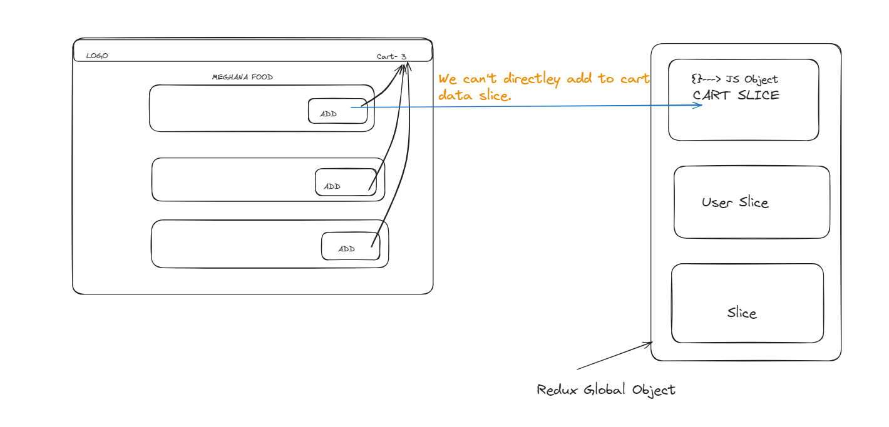
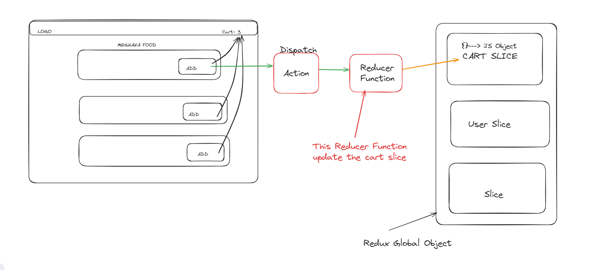
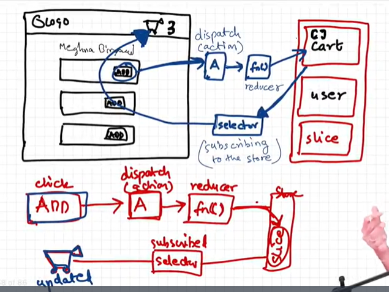
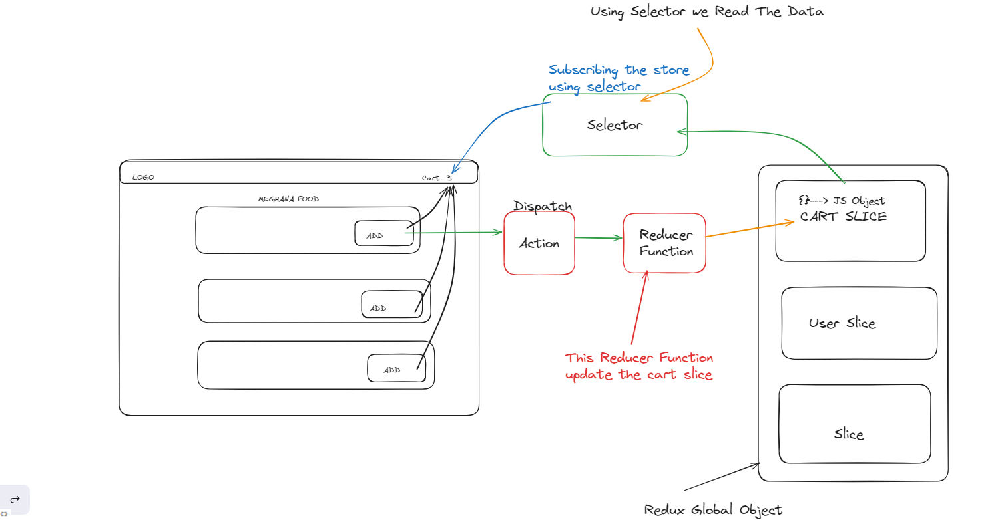
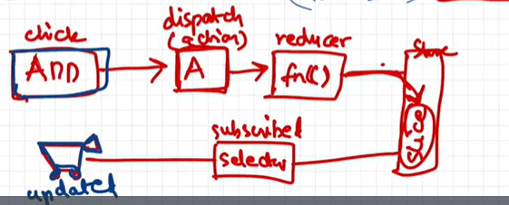
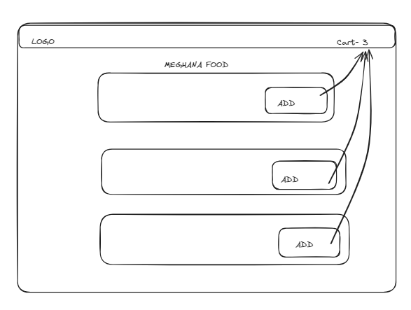
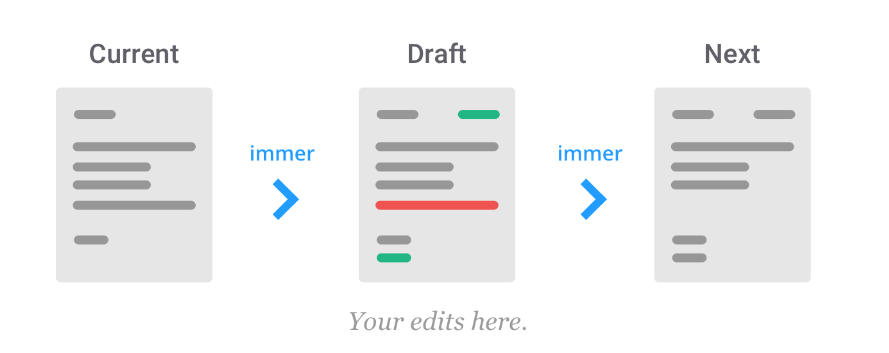

# Episode-12 | Let's Build Our Store

> In this episode we are going to study **redux store**.

- Redux is not mandatorey when you are building small application or mid application you don't need redux.

- But you are building large application where data is heavely use in your react app, a lot of component, data transfer between these component, then use redux.

- **Redux and React are different libraries.**
- Redux is not only libraries whose managing your data. **Zustand** is also a libraries whose managing data.

- **Redux offers easy debugging**

- **There is two libraries redux team offers**
- 1:- **React-Redux**
- 2:- **Redux Toolkit**

## Why we will use Redux Toolkit why not use React-Redux?

- React-Redux was very complecated
- Redux use to need a lot of different packages then redux become powerful.
- Redux require to much boilerplate code.

## Architecture of Redux Toolkit(RDK)

### What is redux store?

- Redux store is nothing but like as a very big JS object and it is kept in a central global place. In React application any component access this store, it can write data ,it can read data from the store and it is like very big JS object.

- In the one big whole object, is it good to keep all the data inside it? - Yes, It is completely fine but so that our redux store dose not become very big very cloumsy we have something known as slices inside redux store. and we can create multiple slices inside our redux store.

### Why do we need slices?

- To keep data seprate, we make logical partition and these logical partition are slices, so assume if you want to add cart data into our redux store, we will create seprate slice for a card data.
- Suppose if we want to keep looged in user info inside our store, so we will create user slice, we create cart slice.

- So what ever we need to create, we will create logical sepration and we will makes small slices inside our redux store.
  
- We can not directley modified to cart data Slice, There is way we can do that, suppose we will click on the add button **I will have to Dispatch and Action**. and this action call a function.

- Action calls a function and this function enternally modified the cart slice. And this function is known as **Reducer function**

### This we learn how to write data?

- **When we hit the add button it dispatch and action which call the reducer function which update the slice of our redux store**
  

### How to read data from cart slice?

- For that we use something known as **selector**, We will use the selector to read the data from a store and this selector
  will modified our react cart component. So this is how read data.

- When we use selector the phenomena is known as **Subscribing to the store**, We say that our heder component cart is subscribing the cart slice store and when I say subscribe the store basically it
  **sync with the store**, If the data inside our store changes my header cart component update automatically. as soon as my store changes that is why we call as subscribing to the store and how do you subscribe using selector.
  
  
  

# Redux Toolkit

- Install @reduxjs/toolkit and react-redux
- Build our Store
- Connect our store to our app
- Create Slice(cart slice)
- dispatch(action)
- Selector

- We created Store using **configureStore** and imported this from `@reduxjs/toolkit`

```
import {configureStore} from "@reduxjs/toolkit";

const appStore = configureSTore({});

export default appStore;
```

- And now this store we will provide to our app using **Provider Component** and imported from `react-redux`.

```
import {Provider} from "react-redux";
import appStore from "./utils/appStore.js"

return (
  <>
  <Provider store={appStore}>
  <App/>
  </Provider>
  </>
)
```

- Now we creating **Slice** for cart using **createSlice()** and imported from `@reduxjs/toolkit`

```
import {createSlice} from "@reduxjs/toolkit";

const cartSlice = createSlice({
  name:"cart",
  initialState:{
    items:[]
  },

  reducers:{
    addItem: (state,action)=>{
       state.items.push(action.payload);
    }
    removeItem: (state, action)=>{
      state.items.pop();
    }
    clearCart: (state,action)=>{
      state.items.length = 0;
    }
  }

})
```

- In slice the first thing is name of the cart slice, the second thing is initial state what is the value of that portion of that store in the redux store what is the initial value and then some actins and reducers functions which will modified the state.

- Now here we will export two things from here.
- We will export our `actions` and we will export our `reducer`

```
export const {addItem, removeItem, clearItem} = cartSlice.actions;

export default cartSlice.reducer;
```

- So what will happen it when we do `createSlice()`, this **createSlice() function will return an object** this `const cartSlice =` and this cartSlice object will looks something like that

```
cartSlice ={
  actions:{
     addItem,
     removeItem,
     clearItem
  }

  reducer,
}
```

- **So cartSlice will be like big object and it has `actions` and `reducer`**.

- So we are exporting this `cartSlice.actions` and `cartSlice.reducer`

```
export const {addItem, removeItem, clearItem} = cartSlice.actions;

export default cartSlice.reducer;
```

- Reducers basically an object and this object have different type actions we can take, what can type we action take, **addItem** we can do **removeItem** we can
  **clearCart**.
- Basically this `addItem:()=>{}` is reducers function with name **addItem but this will mapped into action**.

```
  addItem: ()=>{

    }
  removeItem: ()=>{

    }
  clearCart: ()=>{

    }
```

- How we modified the state of this, we modified this based on state and action.

```
addItem: (state,action)=>{
  // mutating the state here
  state.items.push(action.payload)
    }
removeItem: (state,action)=>{
  state.items.pop()
    }
clearCart: (state,action)=>{
  state.items.length = 0
    }
```

- If you want to modified a store it also has reducer for itself and that reducer combines, reducers of there slices.

- So appStore reducer basically is responsible to modified the appStore and this reducer is basically combination of different small store for each slice we will have different reducer.

```
import {configureStore} from "@reduxjs/toolkit";
import cartReducer from "./cartSlice
"
const appStore = configureStore({
  reducer: {
    cart: cartReducer,
  }
})
```

- Each slice have own reducer so appStore reducer is big reducer for our whole appStore, suppose if have multiple slices , we have userSlice also so we would have added userReducer also.

```
const appStore = configureStore({
  reducer: {
    cart: cartReducer,
    user: userReducer
  }
})
```

- So we have big reducer inside our Store and this whole big reducer is our app reducer and then this reducer contains small reducers of all each slice for each slice there is a reducer and we will just add this reducer inside this appStore reducer.

- So firstly we created store and insde this store we have big app store reducer whose contain all slices reducer and this slice redcucer import from our certSlice.js. Then we will go inside our cartSlice here is the name of our slice is cart and initialState item array is empety and this state item is tells us this is cart slice state whose now have in empety state, then we go on another step, we declare reducers object inside this o bject have reducer function whose contains some cart logic how to add item inside cart and how to remove it and how to empety it using this logic. then other step is we export **cartSlice.actions**, this cartSlice.actions have return object and inside this return object have actions object whose have value of addItem, removeItem and clearCart. and another step have **cartSlice.reducer** and we will also export this.

## Now How will We read the data from cart?

- So basically I want to show how many items there in the cart over on top my app on the header I want to show how many items in the cart.

- So how will we show that remember the diagram we have to **subscribe to the store** using a **selector**, so basically now we will use selector to subcribe our store.

- So we come in header component and in cart <li> we want to show how many items inside this cart like that.
  

- Firstly we write hard coded data inside cartSlice initialState in items array.

```
initialState:{
  items:["burger","pizza"]
}
```

- Now when we will read this items we want to show in header component cart li have 2 dummy items(burger and pizza).

- So ho do I read it, basically we will use selector and selector is hook inside react. and that hook is **useSelector()** and this useSelector comes from **react-redux librarey**.

### How do we use this useSelector() hook?

- So basically this hook gives us access to the store. Now we are subscribing the store using a useSelecotr but we will now tell them what portion of your store we need access to, I need just access to **store.cart.items**

```
import {useSelector} from "react-redux";

const cartItems = useSelector((store)=>store.cart.items)
```

- I want to just subscribe my cart items not user
- and whenever my cart items modified our cartItems will modify and how do I use my cartItems , I can just write my jsx (cartItems.length) and it gives me cart items length.

```
<li>Cart: {cartItems.length}<li/>
```

- And we will console cartItems this show us burger and pizza we have.

```
const cartItems = useSelector((store)=>store.cart.items)
console.log(cartItems)// burger, pizza
```

- so this is how you read this items from cart.

## How we add real world items inside cart initialState items array?

- we have meghana food let's add this on the cart, how can we add this, we will see where is add button and we apply eventlistener onClick on add button and write the logic.

```
const handleAddItem= ()=>{
  // dispatch and action
}

<button onClick={handleAddItem}>Add+<button/>
```

- When we click that button what happens, we have **dispath and action**
- First of all I need access to dispatch and this dispatch function that we gate hook that is known as **useDispatch()** and this useDispatch() hook is again given us **react-redux**.

```
import {useDispatch} from "react-redux";
const dispatch = useDispatch()
```

- This dispatch function dispatch our addItems reducer function whose we export from cartSlice.

```
import {addItems} from "../utils/cartSlice";

const handleAddItem = ()=>{
 // dispatch(addItem(action))
 // action = "Lassi"
  dispatch(addItem("Lassi"))

}
```

- What will I pass in inside dispatch method action ("Lassi") this will go to my reducers function addItems action
  and that to inside **action.payload will be Lassi**.

```
reducers:{
  addItem:(state, action)=>{

     state.items.push(action.payload);
   //state.items.push("Lassi");
   // action.payload = "Lassi"
  }
}
```

- Whenever we call this or dispatch this addItems() redux will create a object and it will create a payload inside this object and it dispatch will add action value "Lassi" indide this object

```


const handleAddItem = ()=>{
 // dispatch(addItem(action))
 // action = "Lassi"
  dispatch(addItem("Lassi"))

}

             {
  action =>      payload:"Lassi"
             }
```

- And it will take this object ({payload:"Lassi" }) aand pass it second argument over reducers function addItems(state,action) and when will we do `action.paylod` you will get this "Lassi"(`action.paylod = "Lassi"`)

- And when we click on add button it will add food on cart, when ever my store is modifying it changing things inside header , we have subscribe this store using useSelector().

- When ever click this add button a **action is dispatch** which calls a reducer function , which update the slice of the store and becauese my header is subscribied to the store using a selector every thing working seamlessely fine. so this is how basically whole loop working behind the scene.
  

# Difference between?

```
onClick(handleAddItem)
onClick(()=>handleAddItem(item))
onClick(handleAddItem(item))
```

These lines of code seem to be related to handling click events in a UI framework or library like React. Let's break them down:

- 1. `onClick(handleAddItem)`: This line is likely passing a function reference (`handleAddItem`) to the `onClick` event handler. When the element associated with this onClick event is clicked, the `handleAddItem` function will be invoked.

- 2. `onClick(() => handleAddItem(item))`: Here, an inline arrow function is created. When the element is clicked, this function will be executed, and within it, `handleAddItem(item)` will be called. This allows for passing additional arguments (`item`) to `handleAddItem`.

- 3. `onClick(handleAddItem(item))`: This line is invalid in most cases, as it directly calls `handleAddItem(item)` when the component renders rather than waiting for the onClick event. It's more appropriate to use a function reference or an inline arrow function for onClick event handlers, as shown in the previous examples.

So, the first two lines are valid ways to handle click events, with the second one allowing for passing additional arguments to the handler function. The third line is likely a mistake or misunderstanding, as it would immediately call the function when rendering the component, rather than waiting for a click event.

## Interview question

- **When ever you are doing useSelector() make sure you are subscribing to the right portion of the store**.

```
const cartItems = useSelector((store)=>store.cart.items);
```

- **If you don't subscribe the right portion of the store it will be a big performance loss**

- Earlier we are subscribing the small portion of the store, **Now we are subscribing the whole store and extracting our items**.

```
const store = useSelector((store)=>store);

const cartItems = store.cart.items;
```

- Suppose our store is very big so anything random changes in our store I want to this component to be affected by this, **I don't want to subscribe my whole store, it is foolish thing**.
- **A better parformance way is to only subscribe to a specific portion of the store**.Alwayes subscribe to small portion of a store.

```
const cartItems = useSelector((store)=>store.cart.items);
```

- Why useSelector name is selector because the name is selector because you are selecting a portion of the store, that's why name is selector.

## Another Interview question

- When we are creating appStore so inside this appStore we use keyword is **reducer** because this is one big reducer of this appStore.

```
const appStore = configureStore({
  reducer:{

  }
})
```

- and inside this one big reducer have **multiple reducers**

```
const appStore = configureStore({
  reducer:{
    cart: cartReducer
  }
})
```

- But when we **creating slice** we create **multiple small reducers functions** so that is why this is known as reducers.
- And when we are exporting this only one reducer from cartSlice.

## Interview question

- When we write vanilla(older) redux reducers function **We can't mutate state directley**.
- firstly we make copy of the state and then mutate state and return it. earlier returning was mandatorey.

```

  reducers:{
    addItem: (state, action)=>{
       const newState = [...state];
       newState.items.push(action.payload);

       return newState;
    }
  }

```

- In new Redux Toolkit we have to mutate the state. but now returning not mandatorey.

```
  reducers:{
    addItem: (state, action)=>{
      // redux toolkit uses immer bts
       state.items.push(action.payload);
    }
  }
```

- inside behind this code redux using vanilla(older) concept and redux uses **immer librarey** to do this, So absically immer librarey kind of like finding difference between the original state and the mutated state and
  then gives a new state which is immutable state a new copy of the state.



> **Explaning in other way -**

```
  reducers:{
    removeItem: (state, action)=>{
      // redux toolkit uses immer bts
       state.items.length = 0
    }
  }
```

- removeItem state is a local variable and this state have value of that original state pass over here so actually have modified.

-So if we do something like that

```
  reducers:{
    removeItem: (state, action)=>{

       state= []
    }
  }
```

it's change (`state= []`) only locally state variable , it will not modified the original state. because local state is a copy of original state so why this original state not modified.

```
  reducers:{
    // original state = {items: ["pizza"]}
    removeItem: (state, action)=>{
       console.log(state)// ["pizza"]
       state= []
       console.log(state)// []
    }
  }
```

- If you will do normal consol log it will not show the state , When we will use current() method then it will show state.

```
  reducers:{

    removeItem: (state, action)=>{
       console.log(current(state))// ["pizza"]
       state= []
       console.log(state)// []
    }
  }
```

- RTK sayes either mutate the existing state or return a new state
  **Mutating the State**

```
  reducers:{
    removeItem: (state, action)=>{
       state.items.length = 0; // original state = {items: ["pizza"]}
    }
  }
```

**Returning the new state** this new [] will be replaced inside originalstate = {items:[]}

```
  reducers:{
    removeItem: (state, action)=>{
      return {items:[]};
    }
  }
```

- So if you do **state.items.length = 0** it will modified this originalstate = {items:[]} or else you return a new state **return {items: []}**

## install redux dev tools chrome extension

- there are dozzens of slices in your app, there are so many components mutating the state from random places subscribing to it, it becomes very hard to see what's going on behind the scene and very hard to debug but using this redux dev tools we can do lot of things.

## Home Work

- learned about redux middleware, hunk and RTK query.
